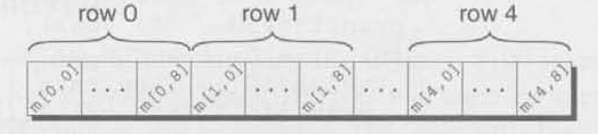

# Graphs

- Before we can implement a Graph in C, we need to uderstand how to work with arrays in C

# Arrays in C

- Simplest array has one dimension.

```c
//       _ _ _ _
// a -> |_|_|_|_|
int a[4];
```

- Since array lengths may need to change, using a macro to define the length of an array is an excellent practice.
```c
# define N 10
int a[N];
```

- In general, if an array contains elements of type T, then each element of the array is treated as if it were a variable of type T.

```c
// For example, the elements below behave like int variables.
a[0]
a[5]
a[i]
```

- Array initialization

```c
// Length of array matches the initializer
int a[10] = { 1, 2, 3, 4, 5, 6, 7, 8, 9, 10 };

// If the initializer is shorter than the array, the remaining elements are given 0.
int a[10] = { 1, 2, 3, 4, 5 };

// Initialize all values to zero
int a[10] = { 0 };
```

- Designated initializers

```c
// We want to initialize only some elements
int a[15] = {0, 0, 29, 0, 0, 0, 7, 0, 0, 0, 48};

// Instead (each number in brackets is said to be a designator).
int a[15] = { [2] = 29, [9] = 7, [14] = 48 };

// Note: the order in which the elements are listed no longer matters.
int a[15] = { [14] = 48, [2] = 29, [9] = 7 };

// If the length of the array is omitted, the compiler will deduce the length from the largest designator
int b[] = { [5] = 10, [23] = 13, [11] = 36, [15] = 29 };
```

# Sizeof Operator

- The sizeof operator can be used to determine the size of the array (in bytes).

```c
int a[10] = { 0 }

// gives us the length of the array
sizeof(a) / sizeof(a[0])

/*
    note: sizeof produces a value of size_t (an unsigned type), as such, some compilers produce a warning message for the expression: sizeof(a) / sizeof(a[0])
    - i is most likely a type int (signed type)
    - Comparing a signed integer with an unsigned integer is a dangerous practice,
*/
for(i = 0; i < sizeof(a) / sizeof(a[0]); i++)
    a[i] = 0;

// We can cast
for(i = 0; i < (int) ( sizeof(a) / sizeof(a[0]) ); i++)
    a[i] = 0;

// We can write a macro to avoid writing that nice expression (more about this in chapter 14.3 parameterized macros)
#define SIZE ( (int) (sizeof (a) / sizeof a([0])) )

for(i = 0; i < SIZE; i++)
    a[i] = 0;
```

# Multidimensional Arrays

- An array may have any number of dimensions.

- We can also use designated initializers in multidimensional arrays.

```c
// row x columns
int m[1][2] = {
            { 5, 20, 5 },
        }; // the rest of the rows will be initialized to 0
```

- C stores arrays in row-major order, with row 0 first, then row 1, and so forth. For example, here's how the marray is stored:



- Note: Multidimensional arrays play a lesser role in C than in many other programming languages, primarily because C provides a more flexible way to store multidimensional data: arrays of pointers (chapter 13.7).

# Variable Length Arrays

- We can determine the length of the array when the program is executed

```c
int n;

printf("How many numbers do you want to reverse? ");
scanf("%d", &n);

// C99 only - length of array depends on n
int a[n];
```

- Can't have static storage duration (need to read about this later)

- Can't have an initializer

# Arrays of Structures

```c
#include <stdio.h>

#define STRINGS 6
#define SEMITONES 22

typedef struct Edge {
   int to 
} Edge;

int main(void) {
  Edge graph[STRINGS][SEMITONES] = {[5][8] = {10}};

  printf("We go from 8 to %d\n", graph[5][8].to);

  return 0;
}
```

