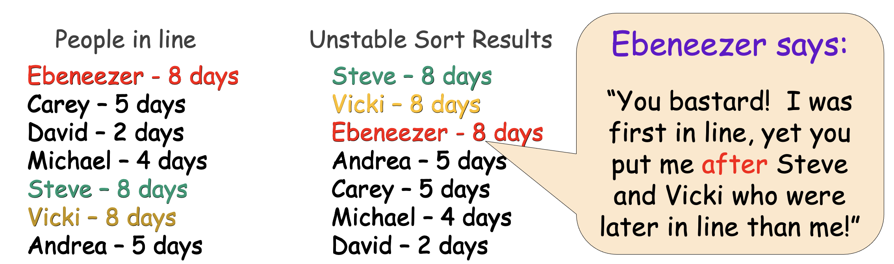
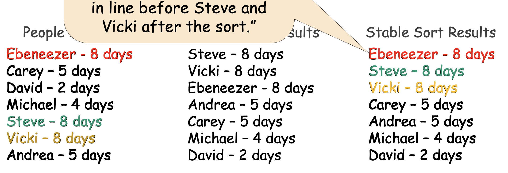

# Common Sorting Algorithms

- The following sorting algorithms are inefficient and won't use them often. But it's like diagramming sentences and will serve as practice.
    - Selection Sort
    - Insertion Sort
    - Bubble Sort

- Sorting is the process of ordering items based on one or more rules subject to one or more constraints.
    - Items: what are we sorting?
    - Rules: How do we order them?
    - Constraints: Is the data in an array or a linked-list?

# Sorting Rules

- Rule #1: Don't choose a sorting algorithm until you understand the requirements of your problem.

- Rule #2: Always choose the simplest sorting algorithm possible that meets your requirements.

# Selection Sort

- Look at all N books, select the shortest book.

- Swap this with the first book.

- Look at the remaining the N-1 books and select the shortest.

- Swap this book with the second book.

- And so on...

## Big O of Selection Sort

- It takes N + N-1 + N-2 + ... + 2 + 1 = (N*(N+1)) / 2

- This is roughly equal to N^2.

- Question: Are there any kinds of input data where Selection Sort is either more or less efficient? If our array is mostly sorted, for example.

- No, Selection Sort takes just as many steps either way!

- Is selection sort stable or unstable? It's unstable.

# What is a Stable Sort?

- Imagine N people line up to buy medication at a drugstore.

- The drugstore wants to sort them and serve them based on urgency.

- The drugstore needs to pick a sort algorithm to re-order the guests. They can choose between a stable or unstable sort.

- An unstable sorting algorithm re-orders the items without taking into account their initial ordering.

- A stable sorting algorithm does take into account the inital ordering when sorting, maintaining the order of similar-valued items.

# Insertion Sort

- Insertion sort is probably the most common way to sort playing cards.

- Focus on first 2 books.
    - If the last book in this set is in the wrong order:
        - Remove it from the shelf.
        - Shift the book before it to the right.
        - Insert our book into the proper slot.

- Focus on first 3 books.
    - If the last book in this set is in the wrong order:
        - Remove it from the shelf.
        - Shift the book before it to the right as necessary.
        - Insert our book into the proper slot.

- Repeat until the shelf is sorted.

- Big O of insertion sort: 1 + 2 + ... + N-1 which is roughly N^2 steps.

- Note, if all books are in the proper order, insertion sort never needs to do any shifting.
In this case, it takes N steps to complete. Conversely, a perfectly mis-ordered set of books is the worst case, N^2.

- Can be used to sort a linked-list (doubly-linked list).

- Insertion sort is a stable sort.

# Bubble Sort

- Start at the top element of the array.

- Compare the first two elemets: A[0] and A[1]. If they're out of order, then swap them.

- Then advance one element in your array. Compare these two elements: A[1] and A[2]. If they're out of order, then swap them.

- When you hit the end, if you made at least one swap, then repeat the whole process again.

- Big O: N passes of N "bubbles" = N^2

- Can it run faster? Yes, if the array is sorted (like insertion sort).

- Bubble sort is a stable sort.

# Shell Sort

- Shell sort based on underlying procedure h-sorting.

- Method for h-sorting an array:

    - Pick a value of h
    - For each element in the array:
        - If A[i] and A[i+h] are out of order:
            - Swap the two elements
        - If you swapped any elements during the last pass, then repeat entire process using same h value.

- After our array is sorted, we say it's h-sorted. For example, if we choose h=3, then after the algorithm completes, every element is smaller than the element that is 3 items later in the array.

- If h=1, then we have bubble sort!

- Shellsort works as follows:

    - Step 1: Select a sequenve of decreasing h-values ending with an h-value of 1 (e.g. 8, 4, 2, 1)
    - Step 2: First, 8-sort the array. Then, 4-sort. Then, 2-sort. Then, 1-sort (bubble sort).

- The array is now fully sorted.

- Each h-sort more correctly sorts the array, making the process simpler each iteration.

- Big O: The worst case is n^2, but the average case has not been determined mathematically. Experimental measurements suggest that the average running time is O(n^1.25). 

- Shell sort is not stable because items that are far apart (h items apart) can move far distances, jumping earlier in the array than items that have their same value.

- Sometimes used in embedded systems with low memory. Shell sort uses fixed amount of memory.

# Advanced Sorting Algorithms

- You can sort billions of values in seconds.
    - Quicksort
    - Mergesort

- These sorts generally work as follows:

    1. Divide the elements to be sorted into two groups of roughly equal size.
    2. Sort each of these smaller groups of elements (conquer).
    3. Combine the two sorted groups into one large sorted list.

- Divide and conquer ---> Think recursion

# Quicksort

1. If the array contains only 0 or 1 element, return.

2. Select an arbitrary element P from the array (typically the first element in the array).

3. Divide: move all elements that are less than or equal to P to the left of the array. Move all elements greater than P to the right (this is called partitioning).

4. Conquer: recursively repeat this process on the left sub-array and then the right sub-array.
